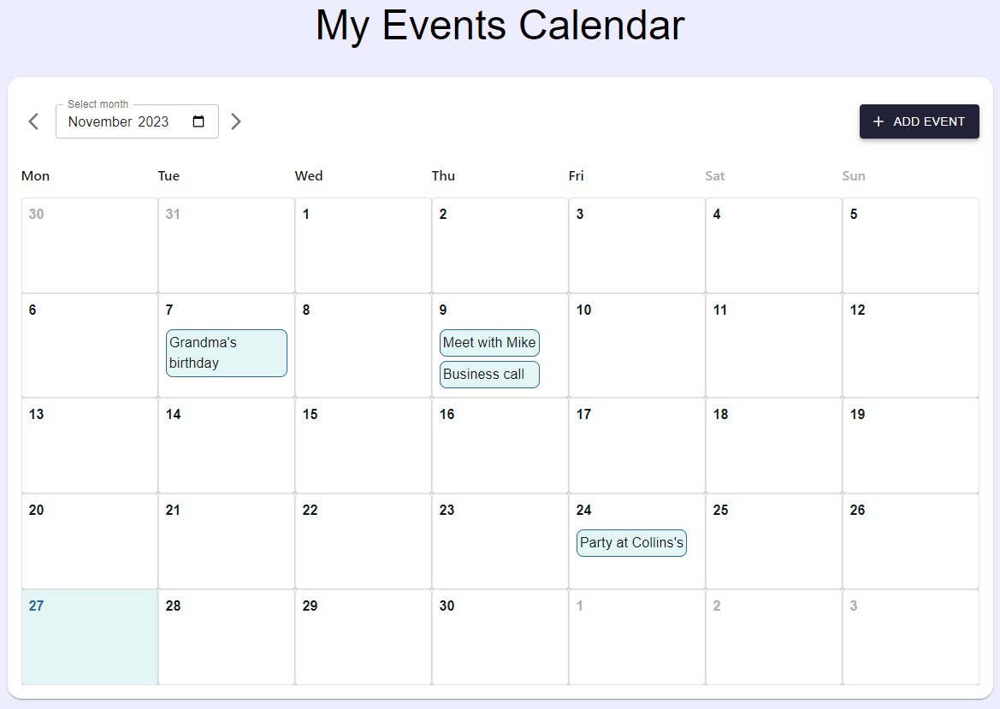
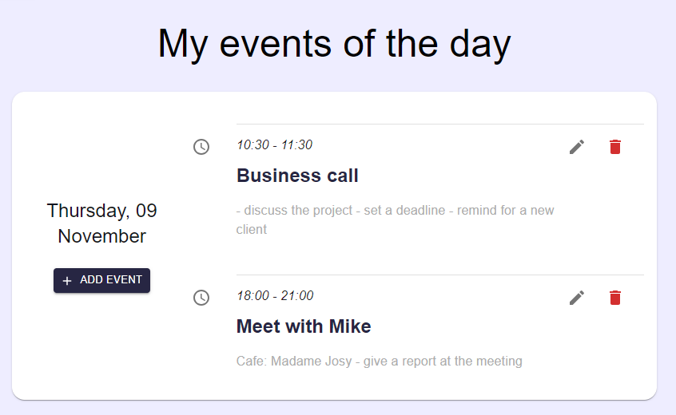
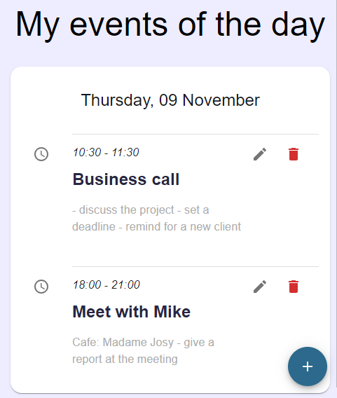

<h1 align="center">Calendar Application</h1>
<h2 align="center">

</h2>

### Description

---

This is a responsive, easy-to-use events calendar React app.
The project was created using React.js, MUI and Redux-Toolkit

### How it works

---

It's a two-page site, and React Router is used to navigate between the main page with a monthly view and the page with a list of events for a particular day.
The application is fully responsive to mobile screens

**Here is the day view, where users can view all events for the selected day:**

 
The user also can add new events, edit and delete them

---
## Getting Started with Create React App

This project was bootstrapped with [Create React App](https://github.com/facebook/create-react-app).

In the project directory, you can run:

#### `npm start`

Runs the app in the development mode.\
Open [http://localhost:3000](http://localhost:3000) to view it in your browser.

The page will reload when you make changes.\
You may also see any lint errors in the console.

### Styling
The project was created using Material Ui. It includes a complete collection of ready-made components that are ready to be used in production right out of the box.
With MUI, this app is fully responsive to smaller screen sizes.

#### `npm install @mui/material @emotion/react @emotion/styled @mui/icons-material`

**Here is a day view with a screen width of less than 500px**

### State management
I use the Redux Toolkit for state management. I store events locally using local storage. 

#### `npm install @reduxjs/toolkit`

---

### Available Scripts

#### `npm test`

Launches the test runner in the interactive watch mode.\
See the section about [running tests](https://facebook.github.io/create-react-app/docs/running-tests) for more information.

#### `npm run build`

Builds the app for production to the `build` folder.\
It correctly bundles React in production mode and optimizes the build for the best performance.

The build is minified and the filenames include the hashes.\
Your app is ready to be deployed!

See the section about [deployment](https://facebook.github.io/create-react-app/docs/deployment) for more information.

#### `npm run eject`

**Note: this is a one-way operation. Once you `eject`, you can't go back!**

If you aren't satisfied with the build tool and configuration choices, you can `eject` at any time. This command will remove the single build dependency from your project.

Instead, it will copy all the configuration files and the transitive dependencies (webpack, Babel, ESLint, etc) right into your project so you have full control over them. All of the commands except `eject` will still work, but they will point to the copied scripts so you can tweak them. At this point you're on your own.

You don't have to ever use `eject`. The curated feature set is suitable for small and middle deployments, and you shouldn't feel obligated to use this feature. However we understand that this tool wouldn't be useful if you couldn't customize it when you are ready for it.

### Learn More

You can learn more in the [Create React App documentation](https://facebook.github.io/create-react-app/docs/getting-started).

To learn React, check out the [React documentation](https://reactjs.org/).
